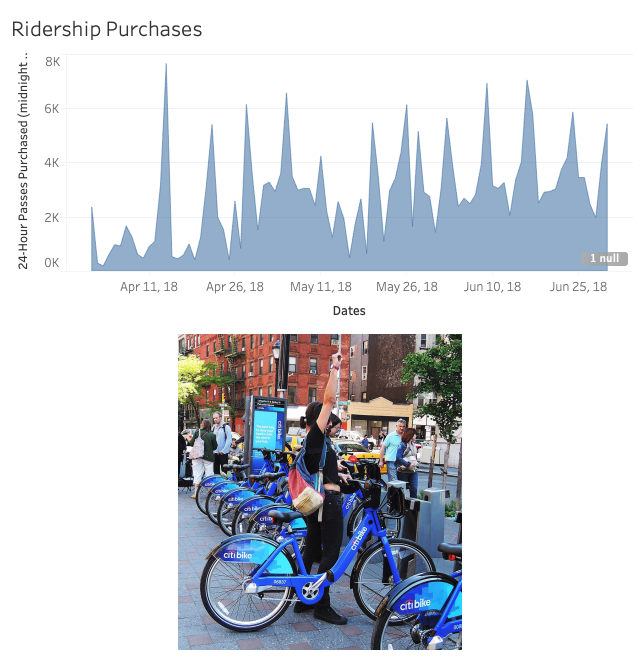
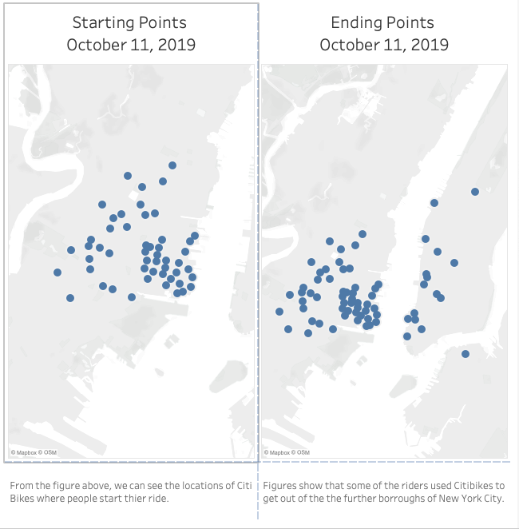
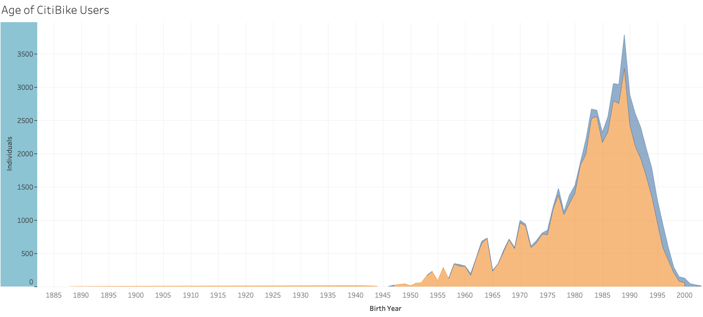
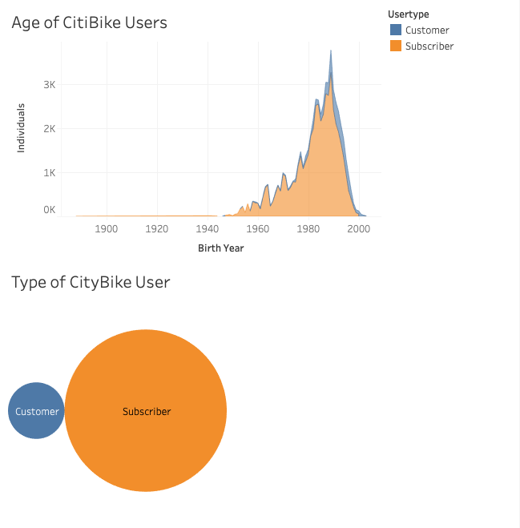

# Citi Bike Analytics

### Report Contents

* Ridership findings from last year

* Ridership start and end locations.  Possible implications 

* Findings were used blah blah [here]

* The 

* You 

* Dashboard for CitiBike report findings can be found here:  [Chou Moua](https://public.tableau.com/profile/chou.moua/#!/)

## Ridership Findings from last Year

Data collected from 2018 Quarter 2 show heavy a fluctuation.  Upon further examination, we have determined that ridership rose and fell heavily with the day of the week.  As expected, weekends drew more customers while Mondays to mid-week days drew less crowds. 

## Start-End Locations

Initial reports from data collected by [Citi Bike Data](https://www.citibikenyc.com/system-data) indicate that on October 11, 2019 trends show that many of our CitiBikes do not end up where they start off.  This is assumed that with the end of the workday, some riders opt to bike back to thier homes in the outlying burroughs.  Implications from these findings show that, as expected, redistribution of CityBikes is in continued need to meet the ongoing traffic of users. 

## CitiBike Users

Taking a closer look at the average profile of CitiBike users is important in targeting efforts to address the needs, successes, and opportunities in the market.  From data collected from Sep 6th 2018, we can take a high-level understanding of our bikeshare users.  

From the graph above, we can see that the majority of our riders are between their mid-20s to early 40s.

However, when we look at the type of ridership, the Subscribers to CitiBike outnumber Customers by approximately 8 to 1. 
